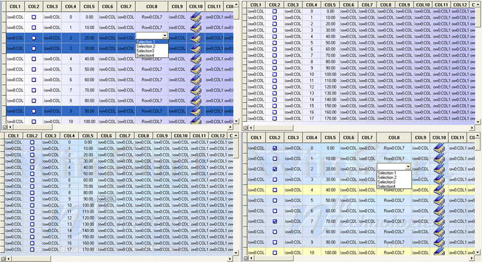

<div align="center">

## ntFlexGrid \- GRADIENT/PICTURE BACKGROUND\! Drag/drop, formatting \- TOO MUCH TO LIST\!


</div>

### Description

This code is a custom control I wrote for use in our companies products. It has tons of implemented ideas in it - way, way too much to list. So a full HTML help file is also included.

The grid will bind directly to an ADO recordset, or will make an internal copy of the recordset if you wish.

I would like to thank everybody that posts on this site. Some of the examples have been invaluable over the years, so I like to return the favors.
 
### More Info
 
Please vote again, I submitted it on the last day of february originally, so it had no chance.

I would like to thank everybody that posts on this site. Some of the examples have been invaluable over the years, so I like to return the favors.


<span>             |<span>
---                |---
**Submitted On**   |2005-03-27 10:19:22
**By**             |[Darryn Frost](https://github.com/Planet-Source-Code/PSCIndex/blob/master/ByAuthor/darryn-frost.md)
**Level**          |Advanced
**User Rating**    |4.9 (304 globes from 62 users)
**Compatibility**  |VB 5\.0, VB 6\.0
**Category**       |[Custom Controls/ Forms/  Menus](https://github.com/Planet-Source-Code/PSCIndex/blob/master/ByCategory/custom-controls-forms-menus__1-4.md)
**World**          |[Visual Basic](https://github.com/Planet-Source-Code/PSCIndex/blob/master/ByWorld/visual-basic.md)
**Archive File**   |[ntFlexGrid1868743272005\.zip](https://github.com/Planet-Source-Code/darryn-frost-ntflexgrid-gradient-picture-background-drag-drop-formatting-too-much-to-list__1-59229/archive/master.zip)

### API Declarations

```
Uses ADO and MSHFlexGrid. Explore the help file before using the grid.
I included the MSHFlexgrid control in the Zip File for those that might not have it already.
```


